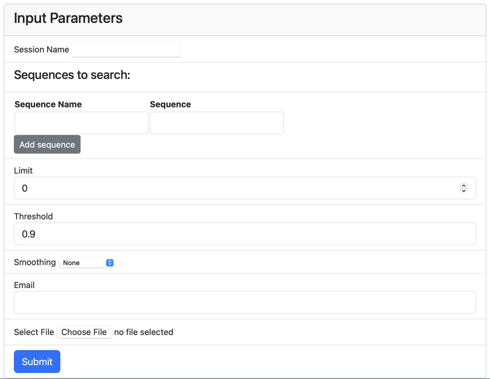
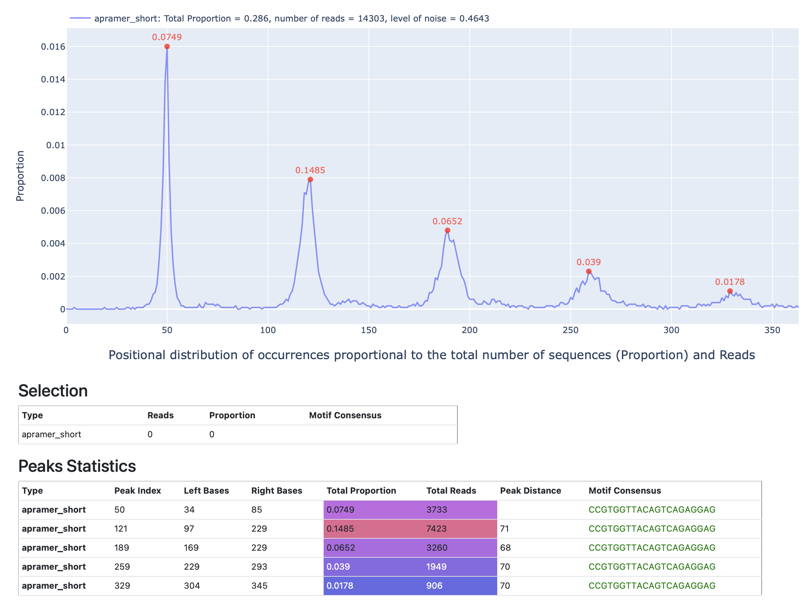
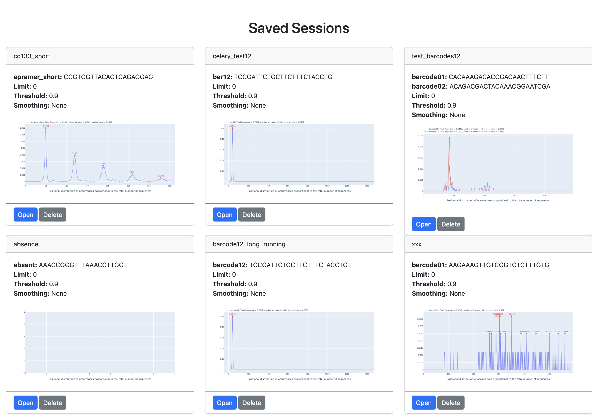

# NanoporeInspect
A web tool aimed at evaluating the quality of nanopore sequencing results.

# How it works:
- Input your service sequences (primers, barcodes, adapters).
- Define your desired similarity threshold for searching.
- Choose a smoothing algorithm (optional).
- Upload your FASTQ file.

- Receive detailed results showing the positional distribution of each specified service sequence across the FASTQ file.

NanoporeInspect empowers users to efficiently evaluate the quality of nanopore sequencing results by providing insightful visualizations and detailed positional information on the distribution of target sequences within the sequencing data.
- The results of each session are saved in /static folder on the server

# Installation
- python 3.9 (miniconda)
- install Redis
- create virtual environment from the requirements.txt

## Required libraries: 
* pandas == 2.2.3
* redis==5.0.8
* flask == 3.0.3
* flask-mail==0.10.0
* requests == 2.32.3
* Bootstrap-Flask == 2.4.0
* flask_wtf == 1.2.1
* plotly == 5.24.1
* werkzeug == 3.0.4
* wtforms == 3.1.2
* numpyencoder == 0.3.0
* celery == 5.5.0b3
* flask_mail == 0.10.0
* Biopython == 1.84
* rapidfuzz == 3.10.0
* numpy == 2.1.1
* tqdm == 4.66.5
* scipy == 1.14.1
* statsmodels == 0.14.3
* whittaker_eilers == 0.1.3
* confsmooth == 1.0.0

# Running
1) Set up environment variables: FLASK_SECRET_KEY, MAIL_USERNAME, MAIL_PASSWORD
2) Create **sessions** director in **static**, and don't forget to change permissions to **static** folder to 777
3) Run app.py
4) Start redis: brew services start redis (i.e. on Mac OS)
5) Start celery worker: celery -A app.celery_app worker --loglevel INFO
6) Start celery beat: celery -A app.celery_app beat --loglevel INFO
7) Configure settings for your email server